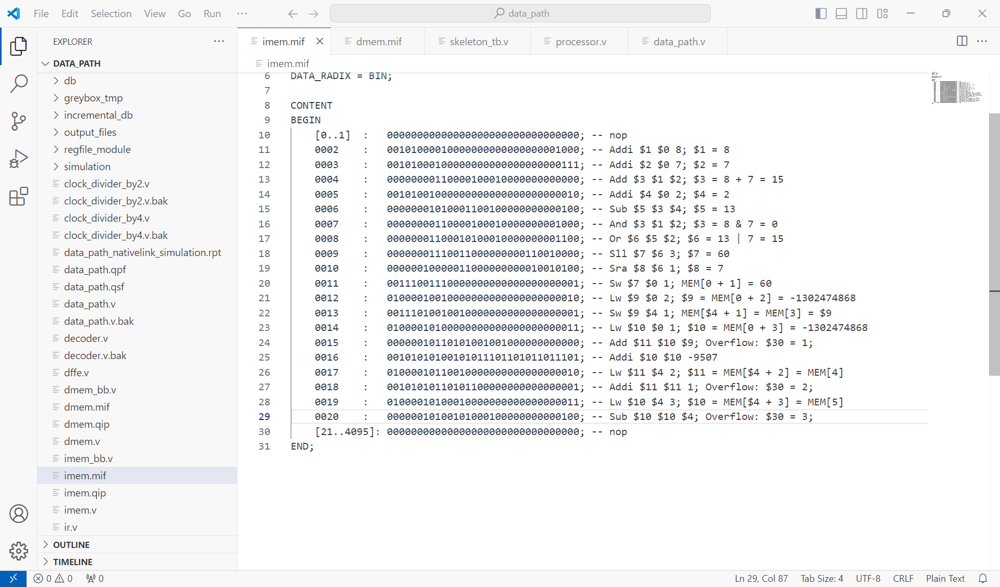

# CheckPoint 4

**Hope all bugs are eliminated : )**

## Todos

- [x] Program Counter

- [x] Instruction Register (not used but prepared for pipeline)

- [x] Decoder

- [x] Sign Extension

- [x] Instruction Memory

- [x] Data Memory

#### Inside Datapath

- [x] R-type Instruction
- [x] addi (Add Immediate Number)
- [x] sw (Store Word)
- [x] lw (Load Word)
- [x] Testbench
----
##### Not included in Check Point 4

- [x] ji (Jump Immediate Number) 

- [x] jal (Store *pc + 1* &  Jump Immediate Number)

- [x] jr (Jump to addr register $rd point to)

- [x] beq (Jump to *pc + 1 + N* if dataA == dataB)

- [x] blt (Jump to *pc + 1 + N* if dataA < dataB)

- [ ] bex

- [ ] setx

  

## Screen Shots

Instructions in imem.mif

Data in dmem.mif

waveform of testbench
