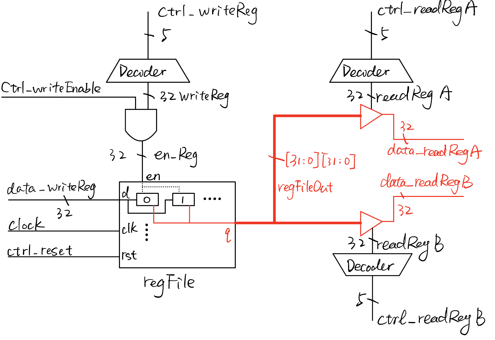

# Probably a CheckPoint
**Student Name:** Toshiko Li
**NetID:** jl1355

## Structure Hierarchy
**Top Entity:**

- **regfile.v**

  - decoder_5_to_32.v

  - reg_group_32_tb.v

    - register.v

  - tri_32.v (Tristate gates)

----

## Tasks
- [x] Implement register.v
- [x] Add testbench register_tb.v
- [x] Implement decoder_5_to_32.v
- [x] Add testbench decoder_5_to_32_tb.v
- [x] Implement reg_group_32.v
- [x] Add testbench reg_group_32_tb.v
- [x] Implement tri_32.v
- [x] Add testbench tri_32_tb.v
- [x] Implement the regfile.v
- [x] Add testbench regFile_tb.v
- [x] Write README file for CheckPoint
