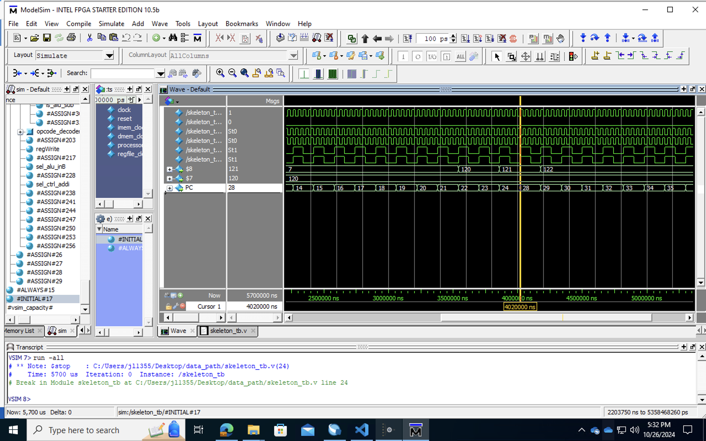
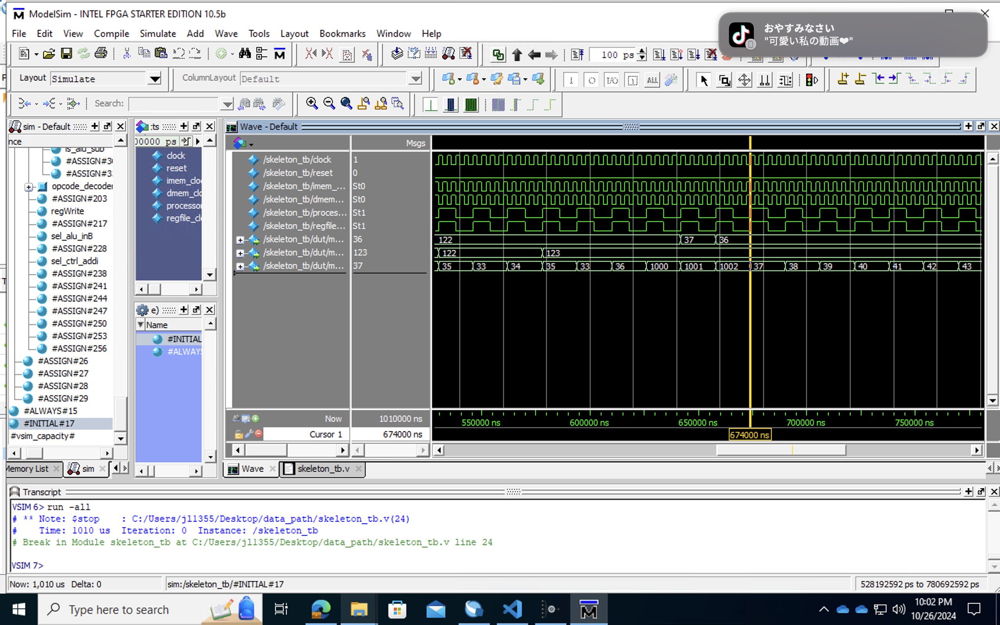
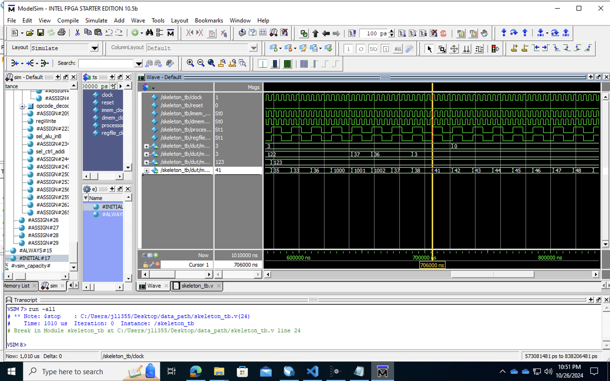
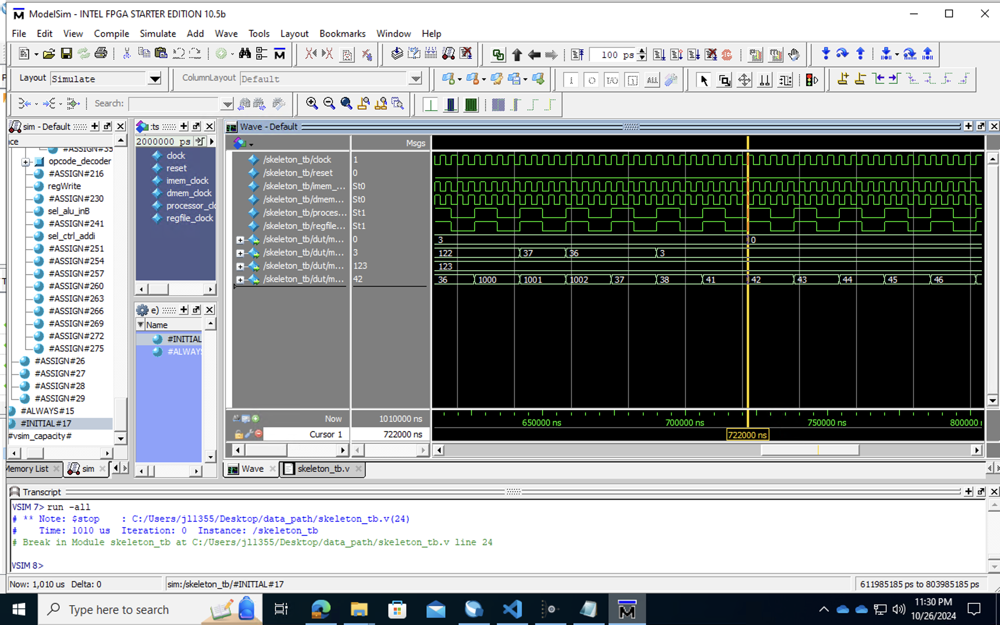

# CheckPoint 5 (Probably)

**probably has lots of bug!**

## Todos

- [x] Program Counter
- [x] Instruction Register (not used but prepared for pipeline)
- [x] Decoder
- [x] Sign Extension
- [x] Instruction Memory
- [x] Data Memory

#### Inside Datapath

- [x] R-type Instruction
- [x] addi (Add Immediate Number)
- [x] sw (Store Word)
- [x] lw (Load Word)
- [x] beq (Jump to *pc + 1 + N* if dataA == dataB) (Validate)
- [x] blt (Jump to *pc + 1 + N* if dataA < dataB) (Validate)
- [x] ji (Jump Immediate Number)  (Validate)
- [x] jal (Store *pc + 1* &  Jump Immediate Number) (Validate)
- [x] jr (Jump to addr register $rd point to) (Validate)
- [x] bex (Validate)
- [x] setx (Validate)
- [x] Testbench

## Waveform Screenshots

1. function: beNotEqual

   ```pseudocode
   0022    :   00010001110100000000000000000010; -- bne $7, $8, 2; $7 = $8 continue
   0023    :   00101010000100000000000000000001; -- addi $8, $8, 1; $8 = 121 
   0024    :   00010001110100000000000000000011; -- bne $7, $8, 3; $7 != $8, pc = pc + 4 = 28
   0025    :   00101010000100000000000000000001; -- addi $8, $8, 1; jumped
   0026    :   00101010000100000000000000000001; -- addi $8, $8, 1; jumped
   0027    :   00101010000100000000000000000001; -- addi $8, $8, 1; jumped
   0028    :   00101010000100000000000000000001; -- addi $8, $8, 1; $8 = 122
   ```



<p align = "center">function beNotEqual testbench waveform</p>


2. function beLessThan

   ```pseudocode
   0029    :   00110010000011100000000000000001; -- blt $8 $7 1; continue
   0030    :   00110001110100000000000000000010; -- blt $7 $8 2; pc = pc + 3 = 33
   0031    :   00101010000100000000000000000001; -- addi $8, $8, 1; jumped
   0032    :   00101010000100000000000000000001; -- addi $8, $8, 1; jumped
   ```


<p align = "center">function beLessThan testbench waveform</p>


3. function Jump immediate number

   ```pseudocode
   0033    :   00110010000011100000000000000010; -- blt $8, $7, 1; if $8 < $7, jump to ins[36]
   0034    :   00101001110011100000000000000001; -- addi $7, $7, 1; $7 += 1
   0035    :   00001000000000000000000000100001; -- jump 33;
   ```


<p align = "center">function Jump Immediate number testbench waveform</p>


4. function jal & jr (jump register)

   ```pseudocode
       	-- jal 1000
       0036    :   00011000000000000000001111101000;
           -- addi $8, $31, 0
       1000 : 00101010001111100000000000000000;
           -- addi $8, $8, -1
       1001 : 00101010000100011111111111111111;
           -- jr $31
       1002 : 00100111110000000000000000000000;
   ```



<p align = "center">function jal & jr testbench waveform</p>


5. function bex

   ```pseudocode
       -- addi $8, $30, 0; $8 = $30 = 3
   0037 : 00101010001111000000000000000000;
       -- bex 41; $30 != 0, jump to ins[41]
   0038 : 10110000000000000000000000101001;
       -- addi $11, $11, 1
   0039 : 00101010110101100000000000000001;
       -- addi $11, $11, 1
   0040 : 00101010110101100000000000000001;
   ```



<p align = "center">function bex testbench waveform</p>


6. function setx

   ```pseudocode
       -- setx 0
   0041 : 10101000000000000000000000000000;
       -- bex 38; $30 = 0, continue
   0042 : 10110000000000000000000000100110;
   ```



<p align = "center">function setx testbench waveform</p>
